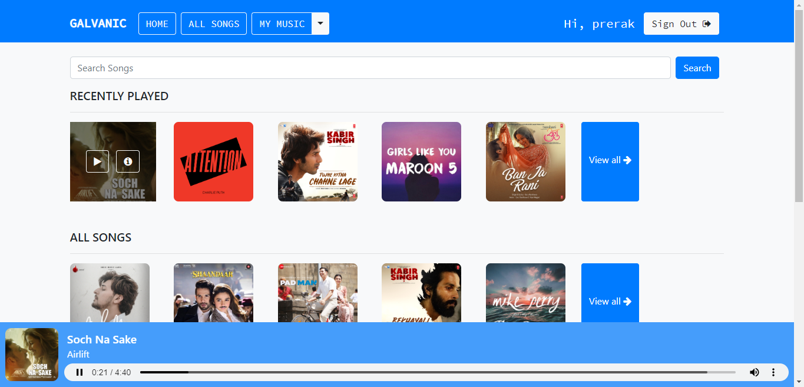
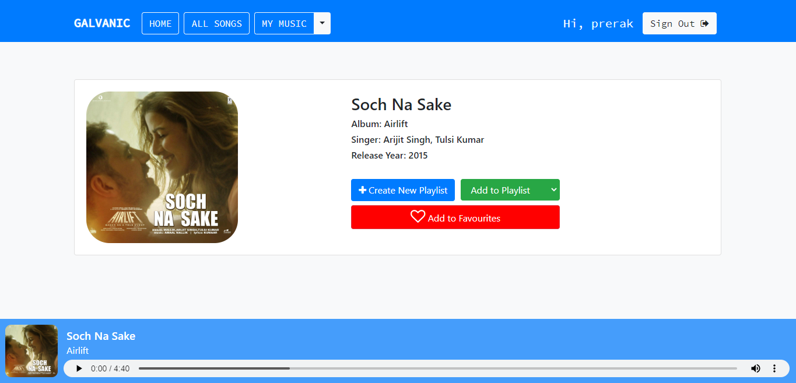

<h1 align="center">GeetSuno</h1>
<h3 align="center">A Music Management/Sharing/Streaming platform.</h3>

### Website Preview
#### Home Page


#### Detail Page


----

## Installation 📦

>pip install -r requirements.txt

#### Clone

- Clone this repo to your local machine.

#### Run server locally

```shell
$ python manage.py runserver
```
> Go to localhost:8000

---

## Features 📋
⚡️ SignUp and SignIn option.\
⚡️ Google SignUp and SignIn option.\
⚡️ Play song, view detailed information of song.\
⚡️ Search songs.\
⚡️ Filter songs based on language and singer.\
⚡️ Create new playlist.\
⚡️ Add/Remove songs to/from playlist.\
⚡️ Add/Remove songs to/from favourites.\
⚡️ Scroll through recently played/viewed songs.\
⚡️ Add/Remove songs from local.\
⚡️ Explore songs through your personalized playlist and favourites.


---

## Contributing 💡


#### Step 1

- **Option 1**
    - 🍴 Fork this repo!

- **Option 2**
    - 👯 Clone this repo to your local machine.


#### Step 2

- **Build your code** 🔨🔨🔨

#### Step 3

- 🔃 Create a new pull request.


## License 📄
This project is licensed under the MIT License - see the [LICENSE.md](./LICENSE) file for details.
